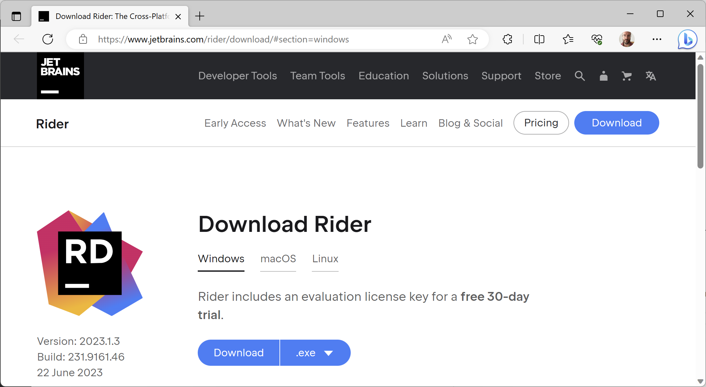
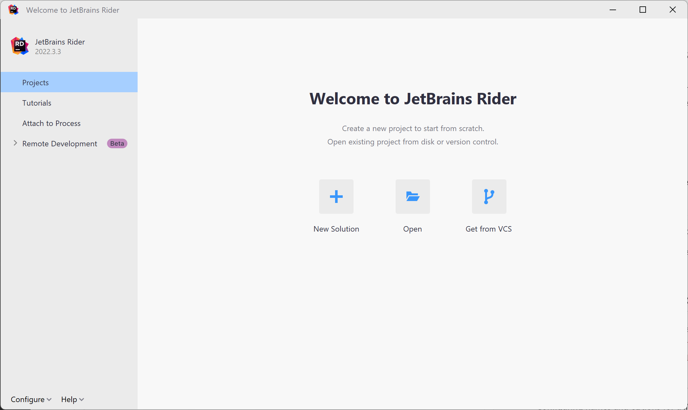
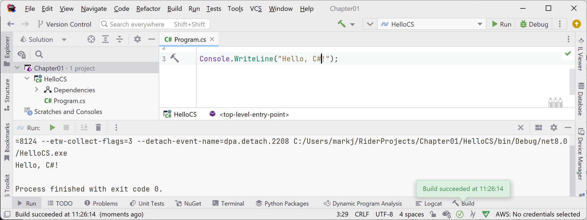
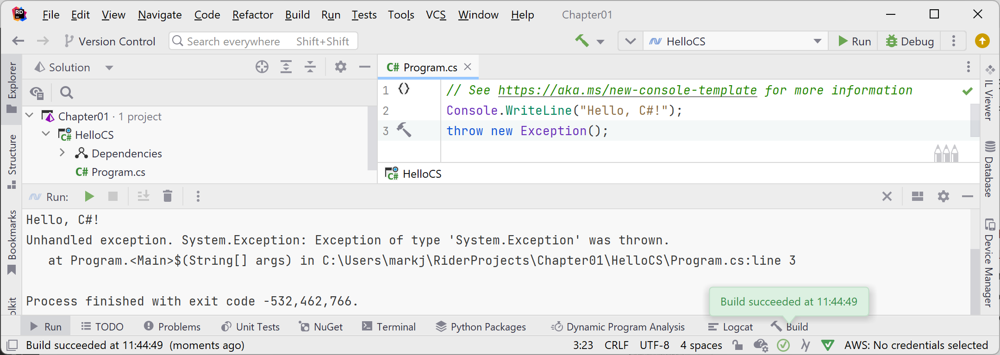
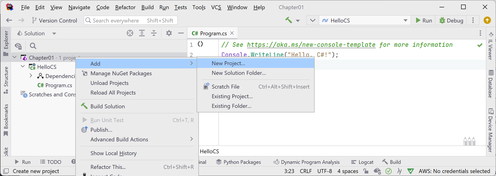
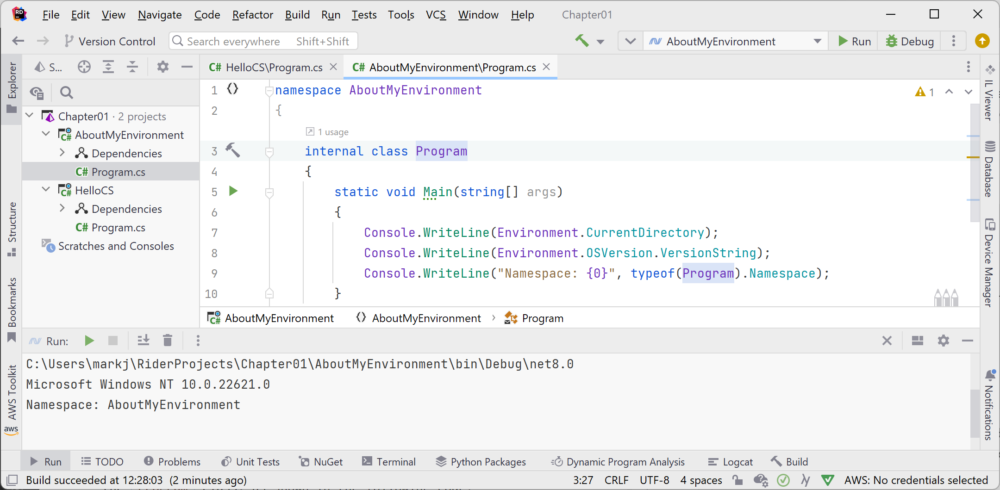

**Using JetBrains Rider**

In this article, I provide detailed step-by-step instuctions for using JetBrains Rider for topics like creating a solution with multiple projects and using debugging tools.

> **Since October 2024, Rider is now free for non-commercial use!** You can learn more about this at the following link: https://blog.jetbrains.com/blog/2024/10/24/webstorm-and-rider-are-now-free-for-non-commercial-use/.

- [Chapter 1 - Hello, C#! Welcome, .NET!](#chapter-1---hello-c-welcome-net)
  - [Downloading and installing JetBrains Rider and Toolbox App](#downloading-and-installing-jetbrains-rider-and-toolbox-app)
  - [Managing multiple projects using JetBrains Rider](#managing-multiple-projects-using-jetbrains-rider)
  - [Writing code using JetBrains Rider](#writing-code-using-jetbrains-rider)
  - [Compiling and running code using JetBrains Rider](#compiling-and-running-code-using-jetbrains-rider)
  - [Understanding the compiler-generated folders and files](#understanding-the-compiler-generated-folders-and-files)
  - [Understanding top-level programs](#understanding-top-level-programs)
  - [Requirements for top-level programs](#requirements-for-top-level-programs)
  - [Implicitly imported namespaces](#implicitly-imported-namespaces)
  - [Revealing the hidden code by throwing an exception](#revealing-the-hidden-code-by-throwing-an-exception)
  - [Revealing the namespace for the Program class](#revealing-the-namespace-for-the-program-class)
  - [Adding a second project using JetBrains Rider](#adding-a-second-project-using-jetbrains-rider)
- [Chapter 2 - Speaking C#](#chapter-2---speaking-c)
  - [Passing arguments to a console app](#passing-arguments-to-a-console-app)
- [Chapter 4 - Writing, Debugging, and Testing Functions](#chapter-4---writing-debugging-and-testing-functions)
  - [Debugging during development](#debugging-during-development)
  - [Creating code with a deliberate bug](#creating-code-with-a-deliberate-bug)
  - [Setting a breakpoint and starting debugging](#setting-a-breakpoint-and-starting-debugging)
  - [Hot reloading using Visual Studio Code and dotnet watch](#hot-reloading-using-visual-studio-code-and-dotnet-watch)
  - [Adding packages to a project in Visual Studio 2022](#adding-packages-to-a-project-in-visual-studio-2022)


# Chapter 1 - Hello, C#! Welcome, .NET!

## Downloading and installing JetBrains Rider and Toolbox App

According to the Stackoveflow Survey 2021, about 20% of professional C# and .NET developers use JetBrains Rider in their day-to-day development work. Rider is cross-platform so you can install and run it on Windows, macOS, and varieties of Linux. You can use an evaluation license key for a free 30-day trial. 

JetBrains also offers a Toolbox App to manage your IDEs the easy way. It's free. It is especially useful for Linux users because Rider does not update through `apt` like normal Linux programs. It also gives you access to Early Access Programs for software like JetBrains Fleet, a next-generation code editor.

If you have not already installed it, let's do so now:

1. Download the latest version of JetBrains Rider from the following link: https://www.jetbrains.com/rider/download/, as shown in *Figure 1.1*:


*Figure 1.1: Download JetBrains Rider*

> If you're on Ubuntu 16.04 or later, you can install Rider from the command promptor terminal, as shown in the following command: `sudo snap install rider --classic`

2. Run the installer.
3. Download the latest version of JetBrains Toolbox App from the following link: https://www.jetbrains.com/toolbox-app/.
4. Run the installer.

## Managing multiple projects using JetBrains Rider

JetBrains Rider uses the same concept of a solution that Visual Studio 2022 does. A solution file (`.sln`) allows you to open and manage multiple projects simultaneously. We will use a solution to manage the two projects that you will create in this chapter.

## Writing code using JetBrains Rider

Let's get started writing code!

1.	Start **JetBrains Rider**.
2.	In the **Welcome to JetBrains Rider** window, click the **New Solution** button, as shown in *Figure 1.3*:


*Figure 1.3: Welcome to JetBrains Rider dialog box with the New Solution button*

3.	In the **New Solution** dialog, in the left-side list of project templates, in the **.NET / .NET Core** section, select **Console Application**, and set additional names and options as shown in *Figure 1.4*:
    - **Solution name**: `Chapter01`
    - **Project name**: `HelloCS`
    - **Solution directory**: `C:\cs12dotnet8` or `C:\Users\<user>\RiderProjects`
    - **SDK**: 8.0
    - **Language**: C#
    - **Framework**: net8.0
    - **Docker Support**: Disabled


*Figure 1.4: Configuring names and options for a Console Application project template*

4.	Click **Create**.
5.	If code is not shown, then in the **Explorer** pane, in its **Solution** view, double-click to open the file named `Program.cs`, and note the code, as shown in *Figure 1.6*:

 
*Figure 1.6: Editing Program.cs in JetBrains Rider*

6.	In `Program.cs`, note the code consists of only a comment and a single statement. This is because it uses the top-level program feature introduced in C# 9, as shown in the following code:
```cs
// See https://aka.ms/new-console-template for more information
Console.WriteLine("Hello, World!");
```

> As the comment in the code says, you can read more about this template at the following link: https://aka.ms/new-console-template.

7.	In `Program.cs`, modify line 9 so that the text that is being written to the console says, `Hello, C#!`.

## Compiling and running code using JetBrains Rider

The next task is to compile and run the code.

1.	In **JetBrains Rider**, navigate to **Run** | **Run 'HelloCS'**. 
2.	The output in the **Run** pane will show the result of running your application, as shown in *Figure 1.7*:


*Figure 1.7: Output of the console application in the Run pane*

3.	Select the `HelloCS` project and then in the **Explorer** pane's toolbar, toggle on the **Show All Files** button, and note the compiler-generated `bin` and `obj` folders are visible, as shown in *Figure 1.8*:


*Figure 1.8: Showing the compiler-generated folders and files*

## Understanding the compiler-generated folders and files

Two compiler-generated folders were created, named `obj` and `bin`. You do not need to look inside these folders or understand their files yet. Just be aware that the compiler needs to create temporary folders and files to do its work. You could delete these folders and their files, and they can be recreated later. Developers often do this to "clean" a project. JetBrains Rider even has a command on the **Build** menu named **Clean Solution** that deletes some of these temporary files for you. 

- The `obj` folder contains one compiled object file for each source code file. These objects haven't been linked together into a final executable yet. 
- The `bin` folder contains the binary executable for the application or class library. We will look at this in more detail in *Chapter 7, Packaging and Distributing .NET Types*.

## Understanding top-level programs

If you have seen older .NET projects before then you might have expected more code, even just to output a simple message. This project has minimal statements because some of the required code is written for you by the compiler when you target .NET 6 or later. 

If you had created the project with .NET SDK 5.0 or earlier, or if you had used Visual Studio 2022 or the `dotnet new` command with options to use the older style, then the `Program.cs` file would have more statements, as shown in the following code:
```cs
using System;

namespace HelloCS
{
  class Program
  {
    static void Main(string[] args)
    {
      Console.WriteLine("Hello, World!");
    }
  }
}
```

During compilation with .NET SDK 6.0 or later, all the boilerplate code to define the `Program` class and its `Main` method is generated and wrapped around the statements you write.

This uses a feature introduced in .NET 5 called top-level programs, but it was not until .NET 6 that Microsoft updated the project template for console apps to use it by default.

> **Warning!** One functional difference is that the auto-generated code does not define a namespace, so the `Program` class is implicitly defined in a `null` namespace with no name instead of a namespace that matches the name of the project.

## Requirements for top-level programs

Key points to remember about top-level programs include the following:
- There can be only one file like this in a project.
- Any `using` statements must go at the top of the file.
- If you declare any classes or other types, they must go at the bottom of the file.
- Although you should name the method `Main` if you explicitly define it, the method is named `<Main>$` when created by the compiler.

## Implicitly imported namespaces

A `using System;` statement at the top of a C# class file imports the `System` namespace. This enables the `Console.WriteLine` statement to work. Why do we not have to import it in our project? 

The trick is that we *do* still need to import the `System` namespace, but it is now done for us using a combination of features introduced in C# 10 and .NET 6. Let's see how:

1.	In the **Explorer**, **Solution**, expand the `obj` folder, expand the `Debug` folder, expand the `net8.0` folder, and open the file named `HelloCS.GlobalUsings.g.cs`.
2.	Note that this file is automatically created by the compiler for projects that target .NET 6 or later, and that it uses a feature introduced in C# 10 called **global namespace imports** that imports some commonly used namespaces like `System` for use in all code files, as shown in the following code:
```cs
// <autogenerated />
global using global::System;
global using global::System.Collections.Generic;
global using global::System.IO;
global using global::System.Linq;
global using global::System.Net.Http;
global using global::System.Threading;
global using global::System.Threading.Tasks;
```

3.	In the **Explorer**, **Solution** pane, click the **Show All Files** button to hide the `bin` and `obj` folders. 

I will explain more about the implicit imports feature in the next chapter. For now, just note that a significant change that happened between .NET 5 and .NET 6 is that many of the project templates, like the one for console apps, use new SDK and language features to hide what is really happening.

## Revealing the hidden code by throwing an exception

Now let's discover how the hidden code has been written:

1.	In `Program.cs`, after the statement that outputs the message, add a statement to throw a new exception, as shown in the following code:
```cs
throw new Exception();
```

2.	Navigate to **Run** | **Run HelloCS**. (Do not start the project with debugging or the exception will be caught by the debugger!)
3.	The output in the console window will show the result of running your application, including that a hidden `Program` class was defined by the compiler with a method named `<Main>$` that has a parameter named `args` for passing in arguments, as shown in *Figure 1.9*:


*Figure 1.9: Throwing an exception to reveal the hidden `Program.<Main>$` method*

## Revealing the namespace for the Program class

Now, let's discover what namespace the `Program` class has been defined within:

1.	In `Program.cs`, after the statement that outputs the message, add statements to get the name of the namespace of the `Program` class, and then write it to the console, as shown in the following code:
```cs
string name = typeof(Program).Namespace ?? "None!";
Console.WriteLine($"Namespace: {name}");
```

> `??` is the null-coalescing operator. The first statement means, "if the namespace of `Program` is `null` then return `None!` otherwise return the name." You will see more explanations of these keywords and operators throughout the book.

2.	In JetBrains Rider, navigate to **Run** | **Run HelloCS**.
3.	The output in the console window will show the result of running your application, including that the hidden `Program` class was defined without a namespace, as shown in the following output:
```
Namespace: None!
```

## Adding a second project using JetBrains Rider

Let's add a second project to our solution to explore top-level programs.

1. In the **Explorer** pane, right-click the solution named `Chapter01` and navigate to **Add** | **New Project**, as shown in *Figure 1.10*:


*Figure 1.10: Adding a new project to the solution*

2.	In the **New Project** dialog, in the **.NET / .NET Core** section, select **Console Application**, and complete the project information:
    - **Project name**: `AboutMyEnvironment`
    - Other options: leave as they are.

> **Note:** Unlike Visual Studio 2022 which has a check box named **Do not use top-level statements** or the `dotnet new` command that has a switch named `--use-program-main`, Rider does not yet support the ability to use the old style project template.

3. Click **Create**.
4. In `Program.cs`, replace the new style template code with the older style, as shown in the following code:
```cs
namespace AboutMyEnvironment
{
  internal class Program
  {
    static void Main(string[] args)
    {
      Console.WriteLine("Hello, World!");
    }
  }
}
```

4.	In `Program.cs`, in the `Main` method, delete the existing `Console.WriteLine` statement and then add statements to output the current directory, the version of the operating system, and the namespace of the `Program` class, as shown in the following code:
```cs
Console.WriteLine(Environment.CurrentDirectory);
Console.WriteLine(Environment.OSVersion.VersionString);
Console.WriteLine("Namespace: {0}", typeof(Program).Namespace);
```

5.	Navigate to **Run** | **Run...***, select **AboutMyEnvironment**, and note the result, as shown the following output and in *Figure 1.11*:
```
C:\Users\markj\RiderProjects\Chapter01\AboutMyEnvironment\bin\Debug\net8.0
Microsoft Windows NT 10.0.22621.0
Namespace: AboutMyEnvironment
```


*Figure 1.11: Running a top-level program in a Rider solution with two projects on Windows*

# Chapter 2 - Speaking C#

## Passing arguments to a console app

1. Right-click the `Arguments` project. 
2. In the popup menu, select **More Run/Debug** | **Modify Run Configuration...**.
3. In the **Program arguments** box, enter the following arguments: `firstarg second-arg third:arg "fourth arg"`, as shown in *Figure 2.11*.
4. Click **Apply**, then click **OK**.
5. Run the console app.


*Figure 2.11: Entering command line arguments in the Rider run configuration*

# Chapter 4 - Writing, Debugging, and Testing Functions

## Debugging during development

In this section, you will learn how to debug problems at development time.

## Creating code with a deliberate bug

Let's explore debugging by creating a console app with a deliberate bug that we will then use the debugger tools in JetBrains Rider to track down and fix:

1.	Use JetBrains Rider to add a new **Console App** / `console` project named `Debugging` to the `Chapter04` solution.
2.	Modify `Debugging.csproj` to statically import `System.Console` for all code files.
3.	`In Program.cs`, delete any existing statements and then at the bottom of the file, add a function with a deliberate bug, as shown in the following code:
```cs
// Functions in Program.cs should be at the bottom of the file.
double Add(double a, double b)
{
  return a * b; // deliberate bug!
}
```
4.	Above the `Add` function, write statements to declare and set some variables and then add them together using the buggy function, as shown in the following code:
```cs
double a = 4.5;
double b = 2.5;
double answer = Add(a, b);

WriteLine($"{a} + {b} = {answer}");
WriteLine("Press Enter to end the app.");
ReadLine(); // Wait for user to press Enter.
```
5.	Run the console application and view the result, as shown in the following output:
```
4.5 + 2.5 = 11.25
Press Enter to end the app.
```
But wait, there's a bug! 4.5 added to 2.5 should be 7, not 11.25!

We will use the debugging tools to hunt for and squish the bug.

## Setting a breakpoint and starting debugging

Breakpoints allow us to mark a line of code that we want to pause at to inspect the program state and find bugs.
Using Visual Studio 2022
Let's set a breakpoint and then start debugging using Visual Studio 2022:
1.	Click in line 1, which is the statement that declares the variable named a.
2.	Navigate to Debug | Toggle Breakpoint or press F9. A red circle will appear in the margin bar on the left-hand side and the statement will be highlighted in red to indicate that a breakpoint has been set, as shown in Figure 4.3:
 
Figure 4.3: Toggling breakpoints using Visual Studio 2022
Breakpoints can be toggled off with the same action. You can also left-click in the margin to toggle a breakpoint on and off, or right-click a breakpoint to see more options, such as delete, disable, or edit conditions or actions for an existing breakpoint.
3.	Navigate to Debug | Start Debugging or press F5. Visual Studio starts the console application and then pauses when it hits the breakpoint. This is known as break mode. Extra windows titled Locals (showing current values of local variables), Watch 1 (showing any watch expressions you have defined), Call Stack, Exception Settings, and Immediate Window may appear. The Debugging toolbar appears. The line that will be executed next is highlighted in yellow, and a yellow arrow points at the line from the margin bar, as shown in Figure 4.4:
 
Figure 4.4: Break mode in Visual Studio 2022
If you do not want to see how to use Visual Studio Code to start debugging, then you can skip the Using Visual Studio Code section and continue to the section titled Navigating with the debugging toolbar.
Using Visual Studio Code
Let's set a breakpoint and then start debugging using Visual Studio Code:
1.	Click in line 1, which is the statement that declares the variable named a.
2.	Navigate to Run | Toggle Breakpoint or press F9. A red circle will appear in the margin bar on the left-hand side to indicate that a breakpoint has been set.
Breakpoints can be toggled off with the same action. You can also left-click in the margin to toggle a breakpoint on and off, or right-click to see more options, such as remove, edit, or disable an existing breakpoint; or add a breakpoint, conditional breakpoint, or logpoint when a breakpoint does not yet exist.
Logpoints, also known as tracepoints, indicate that you want to record some information without having to stop executing the code at that point.
3.	Navigate to View | Run, or in the left navigation bar you can click the Run and Debug icon (the triangle "play" button and "bug") or press Ctrl + Shift + D (on Windows).
4.	At the top of the RUN AND DEBUG window, click the Run and Debug button, and then select the Debugging project, as shown in Figure 4.5:
 
Figure 4.5: Selecting the project to debug using Visual Studio Code
If you are first prompted to choose a debugger, select C#, not .NET 5+ or .NET Core.
5.	Visual Studio Code starts the console app and then pauses when it hits the breakpoint. This is known as break mode. The line that will be executed next is highlighted in yellow, and a yellow block points at the line from the margin bar, as shown in Figure 4.6:
 
Figure 4.6: Break mode in Visual Studio Code
Navigating with the debugging toolbar
Visual Studio 2022 has two debug-related buttons in its Standard toolbar to start or continue debugging and to hot reload changes to the running code, and a separate Debug toolbar for the rest of the tools. 
Visual Studio Code shows a floating toolbar with buttons to make it easy to access debugging features.
Both are shown in Figure 4.7: 
 
Figure 4.7: Debugging toolbars in Visual Studio 2022 and Visual Studio Code
The following list describes the most common buttons in the toolbars:
•	Start/Continue/F5: This button is context sensitive. It will either start a project running or continue running the project from the current position until it ends or hits a breakpoint.
•	Hot Reload: This button will reload compiled code changes without needing to restart the app.
•	Break All: This button will break into the next available line of code in a running app.
•	Stop Debugging/Stop/Shift + F5 (red square): This button will stop the debugging session.
•	Restart/Ctrl or Cmd + Shift + F5 (circular arrow): This button will stop and then immediately restart the program with the debugger attached again.
•	Show Next Statement: This button will move the current cursor to the next statement that will execute.
•	Step Into/F11, Step Over/F10, and Step Out/Shift + F11 (blue arrows over dots): These buttons step through the code statements in various ways, as you will see in a moment.
•	Show Threads in Source: This button allows you to examine and work with threads in the application that you're debugging.
Debugging windows
While debugging, both Visual Studio 2022 and Visual Studio Code show extra windows that allow you to monitor useful information, such as variables, while you step through your code.
The most useful windows are described in the following list:
•	VARIABLES, including Locals, which shows the name, value, and type for any local variables automatically. Keep an eye on this window while you step through your code.
•	WATCH, or Watch 1, which shows the value of variables and expressions that you manually enter.
•	CALL STACK, which shows the stack of function calls.
•	BREAKPOINTS, which shows all your breakpoints and allows finer control over them.
When in break mode, there is also a useful window at the bottom of the edit area:
•	DEBUG CONSOLE or Immediate Window enables live interaction with your code. You can interrogate the program state, for example, by entering the name of a variable. For example, you can ask a question such as "What is 1+2?" by typing 1+2 and pressing Enter.
Stepping through code
Let's explore some ways to step through the code using either Visual Studio 2022 or Visual Studio Code:
The menu commands for debugging are on the Debug menu in Visual Studio 2022 or the Run menu in Visual Studio Code and JetBrains Rider.
1.	Navigate to Run or Debug | Step Into, click on the Step Into button in the toolbar, or press F11. The yellow highlight steps forward one line.
2.	Navigate to Run or Debug | Step Over, click on the Step Over button in the toolbar, or press F10. The yellow highlight steps forward one line. At the moment, you can see that there is no difference between using Step Into or Step Over because we are executing single statements.
3.	You should now be on the line that calls the Add method.
The difference between Step Into and Step Over can be seen when you are about to execute a method call:
•	If you click on Step Into, the debugger steps into the method so that you can step through every line in that method.
•	If you click on Step Over, the whole method is executed in one go; it does not skip over the method without executing it.
4.	Click on Step Into to step inside the Add method.
5.	Hover your mouse pointer over the a or b parameters in the code editing window and note that a tooltip appears showing their current value.
6.	Select the expression a * b, right-click the expression, and select Add to Watch or Add Watch. The expression is added to the WATCH or Watch 1 window, showing that this operator is multiplying a by b to give the result 11.25.
7.	In the WATCH or Watch 1 window, right-click the expression and choose Remove Expression or Delete Watch.
8.	Fix the bug by changing * to + in the Add function.
9.	Restart debugging by clicking the circular arrow Restart button or pressing Ctrl or Cmd + Shift + F5.
10.	Step over the function, take a minute to note how it now calculates correctly, and click the Continue button or press F5.
11.	With Visual Studio Code, note that when writing to the console during debugging, the output appears in the DEBUG CONSOLE window instead of the TERMINAL window, as shown in Figure 4.8:
 
Figure 4.8: Writing to the DEBUG CONSOLE during debugging
Using the Visual Studio Code integrated terminal during debugging
By default, the console is set to use the internal DEBUG CONSOLE during debugging, which does not allow interactions like entering text from the ReadLine method.
To improve the experience, we can change a setting to use the integrated terminal instead. First, let's modify the code to require interaction with the user:
1.	At the top of Program.cs, add statements to prompt to user to enter a number and parse that as a double into the variable a, as shown highlighted in the following code:
Write("Enter a number: ");
string number = ReadLine()!;

double a = double.Parse(number);
2.	Set a breakpoint on line 1 that writes the prompt, Enter a number.
3.	At the top of the RUN AND DEBUG window, click the Run and Debug button, and then select the Debugging project.
4.	Note that the Enter a number prompt is not written to either TERMINAL or DEBUG CONSOLE and neither window is waiting for the user to enter a number and press Enter.
5.	Stop debugging.
6.	At the top of the RUN AND DEBUG window, click the create a launch.json file link, and then when prompted for the debugger select C#, as shown in Figure 4.9:
 
Figure 4.9: Selecting a debugger for the launch.json file
7.	In the launch.json file editor, click the Add Configuration... button, and then select .NET: Launch .NET Core Console App, as shown in Figure 4.10:
 
Figure 4.10: Adding a launch configuration for a .NET Console App 
8.	In launch.json, make the following additions and changes, as shown highlighted in the following configuration:
•	Comment out the preLaunchTask setting.
•	In the program path, add the Debugging project folder after the workspace folder variable.
•	In the program path, change <target-framework> to net8.0.
•	In the program path, change <project-name.dll> to Debugging.dll.
•	Change the console setting from internalConsole to integratedTerminal.
{
  // Use IntelliSense to learn about possible attributes.
  // Hover to view descriptions of existing attributes.
  // For more information, visit: https://go.microsoft.com/fwlink/?linkid=830387
  "version": "0.2.0",
  "configurations": [
    {
      "name": ".NET Core Launch (console)",
      "type": "coreclr",
      "request": "launch",
      //"preLaunchTask": "build",
      "program": "${workspaceFolder}/Debugging/bin/Debug/net8.0/Debugging.dll",
      "args": [],
      "cwd": "${workspaceFolder}",
      "stopAtEntry": false,
      "console": "integratedTerminal"
    }
  ]
}
Remember that with Visual Studio Code, we open the Chapter04 folder to process the solution file, so the workspace folder is Chapter04, not the Debugging project.
9.	At the top of the RUN AND DEBUG window, note the dropdown list of launch configurations, and click the Start Debugging button (green triangle), as shown in Figure 4.11.
10.	Navigate to View | Terminal and note the TERMINAL window is attached to the Debugging.dll, as shown in Figure 4.11.
11.	Step over the statement that writes Enter a number: to the console.
12.	Step over the statement that calls ReadLine.
13.	Type 5.5 and press Enter.
14.	Continue stepping through the statements or press F5 or click Continue, and note the output written to the integrated terminal, as shown in Figure 4.11:
 
Figure 4.11: A launch configuration set to use the integrated terminal for user interaction
Customizing breakpoints
It is easy to make more complex breakpoints:
1.	If you are still debugging, click the Stop button in the debugging toolbar, navigate to Run or Debug | Stop Debugging, or press Shift + F5.
2.	Navigate to Run | Remove All Breakpoints or Debug | Delete All Breakpoints.
3.	Click on the WriteLine statement that outputs the answer.
4.	Set a breakpoint by pressing F9 or navigating to Run or Debug | Toggle Breakpoint.
5.	Right-click the breakpoint and choose the appropriate menu for your code editor: 
•	In Visual Studio Code, choose Edit Breakpoint... .
•	In Visual Studio 2022, choose Conditions... .
6.	Type an expression, such as the answer variable must be greater than 9, and then press Enter to accept it, and note the expression must evaluate to true for the breakpoint to activate, as shown in Figure 4.12:
 
Figure 4.12: Customizing a breakpoint with an expression using Visual Studio Code
7.	Start debugging and note the breakpoint is not hit.
8.	Stop debugging.
9.	Edit the breakpoint or its conditions and change its expression to less than 9.
10.	Start debugging and note the breakpoint is hit.
11.	Stop debugging.
12.	Edit the breakpoint or its conditions (in Visual Studio 2022 click Add condition), select Hit Count, then enter a number such as 3, meaning that you would have to hit the breakpoint three times before it activates, as shown in Figure 4.13:
 
Figure 4.13: Customizing a breakpoint with an expression and hot count using Visual Studio 2022
13.	Hover your mouse over the breakpoint's red circle to see a summary, as shown in Figure 4.14:
 
Figure 4.14: A summary of a customized breakpoint in Visual Studio Code
You have now fixed a bug using some debugging tools and seen some advanced possibilities for setting breakpoints.
Hot reloading during development
Hot Reload is a feature that allows a developer to apply changes to code while the app is running and immediately see the effect. This is great for fixing bugs quickly. Hot Reload is also known as Edit and Continue. A list of the types of changes that you can make that support Hot Reload is found at the following link: https://aka.ms/dotnet/hot-reload.
Just before the release of .NET 6, a high-level Microsoft employee caused controversy by attempting to make the feature Visual Studio-only. Luckily the open-source contingent within Microsoft successfully had the decision overturned. Hot Reload remains available using the command-line tool as well.
Let's see it in action:
1.	Use your preferred coding tool to add a new Console App / console project named HotReloading to the Chapter04 solution.
2.	Modify HotReloading.csproj to statically import System.Console for all code files.
3.	In Program.cs, delete the existing statements and then write a message to the console every two seconds, as shown in the following code:
/* Visual Studio 2022: run the app, change the message, click Hot Reload.
 * Visual Studio Code: run the app using dotnet watch, change the message. */

while (true)
{
  WriteLine("Hello, Hot Reload!");
  await Task.Delay(2000);
}
Hot reloading using Visual Studio 2022
If you are using Visual Studio, Hot Reload is built into the user interface:
1.	In Visual Studio 2022, start the project and note that the message is output every two seconds.
2.	Leave the project running.
3.	In Program.cs, change Hello to Goodbye.
4.	Navigate to Debug | Apply Code Changes or click the Hot Reload button in the toolbar as shown in Figure 4.15, and note the change is applied without needing to restart the console app.
5.	Drop down the Hot Reload button menu and select Hot Reload on File Save, as shown in Figure 4.15:
 
Figure 4.15: Changing Hot Reload options
6.	Change the message again, save the file, and note the console app updates automatically.

## Hot reloading using Visual Studio Code and dotnet watch

If you are using Visual Studio Code, you must issue a special command when starting the console app to activate Hot Reload:
1.	In Visual Studio Code, in **TERMINAL**, start the console app using dotnet watch, and note the output that shows that hot reload is active, as shown in the following output:
```
dotnet watch 🔥 Hot reload enabled. For a list of supported edits, see https://aka.ms/dotnet/hot-reload.
  💡 Press "Ctrl + R" to restart.
dotnet watch 🔧 Building...
  Determining projects to restore...
  All projects are up-to-date for restore.
  HotReloading -> C:\cs12dotnet8\Chapter04\HotReloading\bin\Debug\net8.0\HotReloading.dll
dotnet watch 🚀 Started
Hello, Hot Reload!
Hello, Hot Reload!
Hello, Hot Reload!
```
2.	In Visual Studio Code, change Hello to Goodbye, and note that after a couple of seconds the change is applied without needing to restart the console app, as shown in the following output:
```
Hello, Hot Reload!
dotnet watch ⌚ File changed: .\Program.cs.
Hello, Hot Reload!
Hello, Hot Reload!
dotnet watch 🔥 Hot reload of changes succeeded.
Goodbye, Hot Reload!
Goodbye, Hot Reload!
```
3.	Press *Ctrl* + *C* to stop it running, as shown in the following output:
```
Goodbye, Hot Reload!
dotnet watch 🛑 Shutdown requested. Press Ctrl+C again to force exit.
```
Now that you've seen tools for finding and removing bugs during development, let's see how you can track down less obvious problems that might happen during development and production.

## Adding packages to a project in Visual Studio 2022

JetBrains Rider has a graphical user interface for adding packages:

1.	In Solution Explorer, right-click the Instrumenting project and select Manage NuGet Packages.
2.	Select the Browse tab.
3.	Search for each of these NuGet packages and click the Install button, as shown in Figure 4.19:
•	Microsoft.Extensions.Configuration.Binder
•	Microsoft.Extensions.Configuration.Json
 
Figure 4.19: Installing NuGet packages using Visual Studio 2022
Good Practice: There are also packages for loading configuration from XML files, INI files, environment variables, and the command line. Use the most appropriate technique for setting configuration in your projects.
